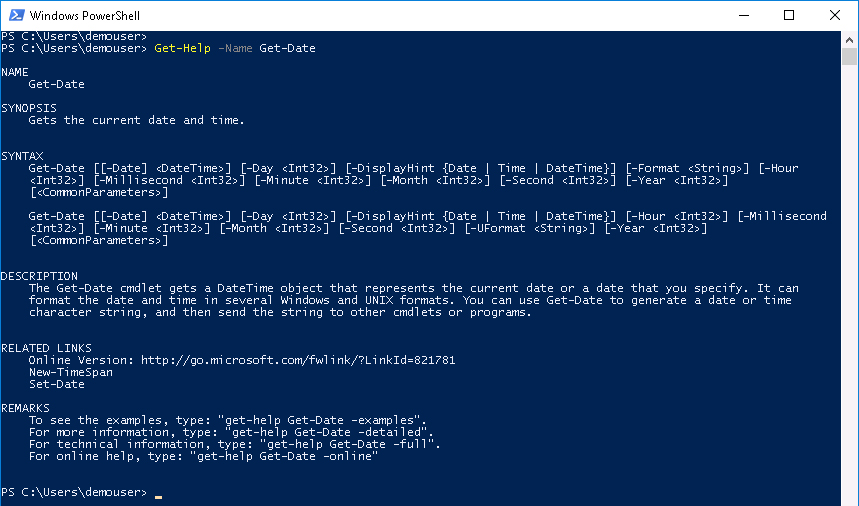
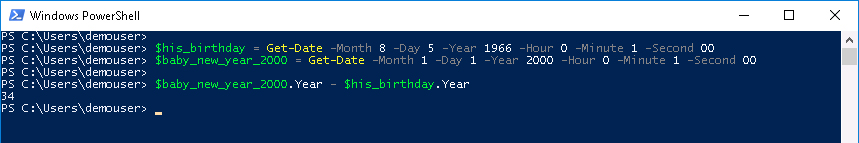
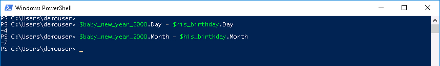
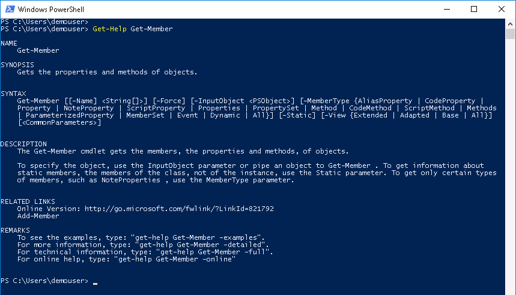
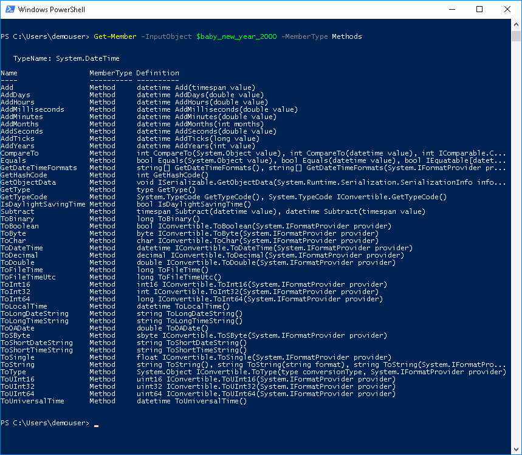
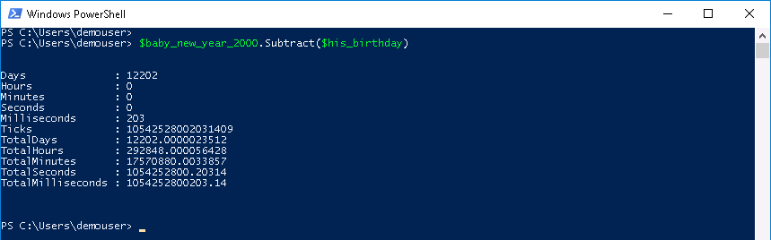
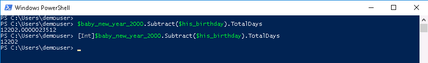

# PowerShell Cmdlets and Objects

This lab is all about PowerShell Cmdlets and Objects.

## Objectives

After completing this lab you will know:

  - What a PowerShell Cmdlet is
  - How to Get-Help for a Cmdlet
  - What a PowerShell Object is
  - PowerShell Aliasing
  - PowerShell Arrays
  - Why PowerShell Objects are Awesome

## Prerequisites

It would be great if you have gone through the **PowerShell Introduction** Lab. You'll need a Windows Desktop with PowerShell installed. While it is true that [PowerShell Core](https://github.com/powershell/powershell) will run on Linux and macOS, we will using a Windows desktop in this lab.

## Product

PowerShell is made by Microsoft.

The items covered in this lab and other PowerShell focused labs are greatly influenced by this [PowerShell Scripting](https://msdn.microsoft.com/en-us/powershell/scripting/powershell-scripting) content on the [Microsoft Developer Network](https://msdn.microsoft.com/en-us/default.aspx).

### DevNet Sandbox Utilization

All this lab really requires is a Windows Desktop that has PowerShell, if you don't happen to have a Windows Desktop available that's OK. This lab can be completed using the DevNet UCS Management Sandbox, there is a Windows 2012 VM as part of the sandbox. reserve your environment [here](https://devnetsandbox.cisco.com/RM/Diagram/Index/3323b7b0-b70b-4b1e-a929-6bdbff3aac8a?diagramType=Topology).

# Step 1: Understanding PowerShell Cmdlets

A PowerShell Cmdlet (pronounced command-let) is a lightweight command that is used in the Windows PowerShell environment. The Windows PowerShell runtime invokes these Cmdlets within the context of automation scripts that are provided at the command line. The Windows PowerShell runtime also invokes them programmatically through Windows PowerShell APIs. - So says [Microsoft](https://msdn.microsoft.com/en-us/library/ms714395%28v=vs.85%29.aspx?f=255&MSPPError=-2147217396)

PowerShell and Cmdlets are pretty much the best thing to happen to Windows since [eating your own dogfood](https://blog.codinghorror.com/showstopper/) (AKA dogfooding). Be sure to read that some other time, don't get distracted now.

The father of PowerShell [Jeffery Snover](https://en.wikipedia.org/wiki/Jeffrey_Snover) described in a 2011 interview the need for PowerShell like this:

  - When I came to Microsoft, I knew that we needed an automation story. I had asked people about that and they said, “Oh, we have one.” I said, “Well, what is it?” They’d say, “Well, it’s VB Script.” I said, “Oh, my friend. You do not understand what we need.”

He goes on to explain how PowerShell helps IT Professionals understand their systems

  - PowerShell allows you to see beyond the surface of the system and get at the true details and manipulate those, and it’s through our reflection-based stuff. When you run a command, we show you essentially a report, but then you can drill in and find out some more details. Look for the patterns; take these things, file them off to a file, keep logs. Put it in an Excel spreadsheet, analyze the data. Really understand your system.

The PowerShell Cmdlet is the way to get those details and be able to manipulate them.  In the PowerShell Introduction lab we explored a few very simple Cmdlets using at most a single parameter for some of those Cmdlets. We saw that a Cmdlet as basic as `Get-Date` actually contained a significant amount of power.  `Get-Date` didn't just return a text string, it returned a date object that was packed with functionality.

### Exercise 1

First things first, how can you find out what a Cmdlet can do?

  1. Open the PowerShell Console, by ***double-clicking*** the desktop shortcut, if it is not already open.

  PowerShell Desktop Shortcut:

  <br/><br/>

  <br/><br/>

  If there is no desktop shortcut you can typically find PowerShell under the **Windows PowerShell** menu or by typing *cmd-s* to bring up search and then search for **PowerShell**.  

  2. At the prompt type:

    ```PowerShell
    Get-Help -Name Get-Date
    ```

    </br>Get-Help -Name Get-Date Output:

    <br/><br/>

    <br/><br/>

  There are minimally two different ways to run `Get-Date`. If you want in-depth help, look at the options for running `Get-Help` under the **REMARKS** section. Read the **DESCRIPTION** to better understand what `Get-Date` can provide. Not only does `Get-Date` provide the current date and time, but it can also be used to create other date and time objects. Does that make sense? Suppose you want to find the time between one date and January 1st 2000 at 12:01:00 AM in Years, Days, Minutes, and Seconds.

  Let's use my Birthday, August 5th, 1966 at 11:01:00 PM, I'm sure I have the seconds wrong but let's just go with 00.<br/><br/>

  3. At the prompt type:

    ```PowerShell
    $his_birthday = Get-date -Month 8 -Day 5 -Year 1966 -Hour 0 -Minute 1 -Second 00

    $baby_new_year_2000 = Get-date -Month 1 -Day 1 -Year 2000 -Hour 0 -Minute 1 -Second 00

    $baby_new_year_2000.Year - $his_birthday.Year
    ```

    </br>Date and Time Arithmetic Output:

    <br/><br/>

    <br/><br/>

  The Year difference makes sense but that doesn't really work for Day, because Day is the day of the month. If I had to make a guess, if you tried the same thing for Day the result would be -4, because 1 - 5 is -4. Same thing for Month except you'll get -7. Try it.

    4. At the prompt type:

      ```PowerShell
      $baby_new_year_2000.Day - $his_birthday.Day

      $baby_new_year_2000.Month - $his_birthday.Month
      ```

      </br>More Date and Time Arithmetic Output:

      <br/><br/>

      <br/><br/>

    So what to do now? Do you remember how to look at the object members? Because there is a member method that will **Subtract** a date object from another date object and provide a good deal of information.

### Exercise 2

Find the member method that subtracts a date object from a date object.

  1. At the prompt type:

    ```PowerShell
    Get-Help Get-Member
    ```

    </br>Get-Help Get-Member Output

    <br/><br/>

    <br/><br/>

    I didn't forget the parameter `-Name` for the `Get-Help` Cmdlet. Parameters in PowerShell can be referenced by position. If you want to know more about `Get-Help`, you can always try `Get-Help Get-Help`

    Looking at the output of `Get-Help Get-Member`, there is a parameter to specify what **MemberType** you would like to see. Let's just look at member **methods** for the date object `$baby_new_year_2000`.<br/><br/>

  2. At the prompt type:

    ```PowerShell
    Get-Member -InputObject $baby_new_year_2000 -MemberType Methods
    ```

    </br>Get-Member Methods Output

    <br/><br/>

    <br/><br/>

    There is a method called **Subtract**, let's use that method to subtract `$his_birthday` from `$baby_new_year_2000`.<br/><br/>

  3. At the prompt type:

    ```PowerShell
    $baby_new_year_2000.Subtract($his_birthday)
    ```

    </br>Date Object Subtract Method Output:

    <br/><br/>

    <br/><br/>

    Now you see the difference in Days, Hours, Minutes, and even Milliseconds.

    Remember in PowerShell everything is an object so those labels and values you see printed out are member properties of the resulting *"Subtraction Object"*

    You can access them just like any other member property `$variable-name.property`.

    For example if you just wanted the number of days between `$his_birthday` and `$baby_new_year_2000`, access the **TotalDays** property.<br/><br/>

  4. At the prompt type:

    ```PowerShell
    $baby_new_year_2000.Subtract($his_birthday).TotalDays
    ```

    Now if you didn't want a decimal, you could always **cast** the returned value to an Integer.

    ```PowerShell
    [Int]$baby_new_year_2000.Subtract($his_birthday).TotalDays
    ```

    </br>Date Object Subtract Member Select Output:

    <br/><br/>

    <br/><br/>

    Some pretty interesting stuff and it's all there at your fingertips, with Cmdlets like `Get-Help` and `Get-Member`.

Next Step: A Deeper Look at the PowerShell Object.
