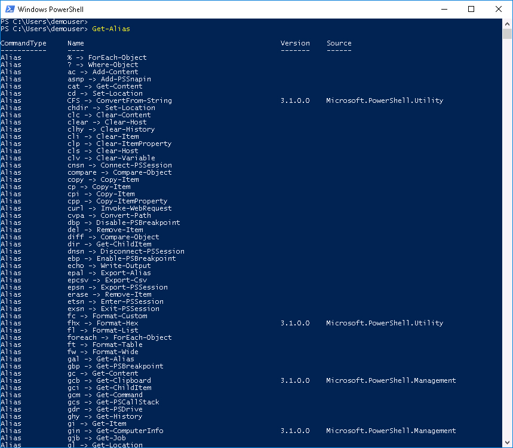
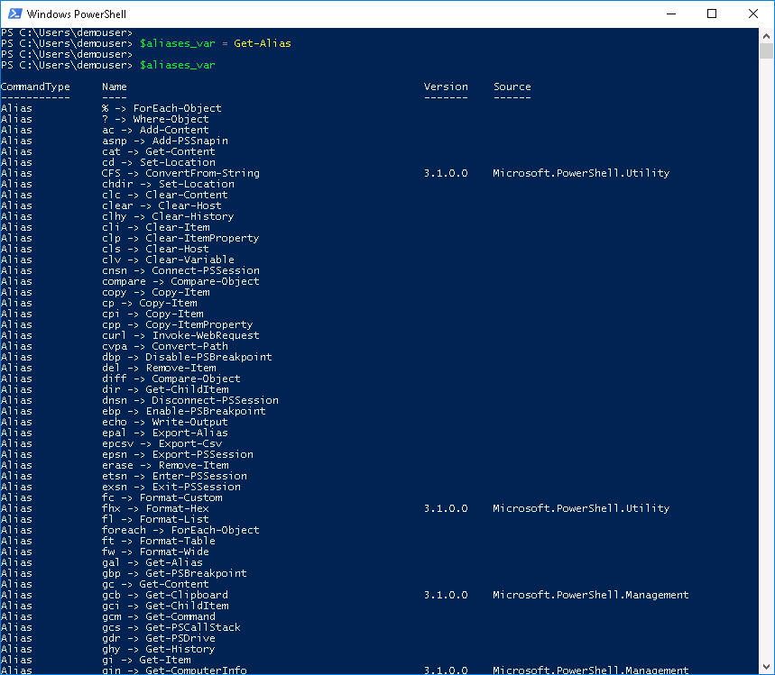
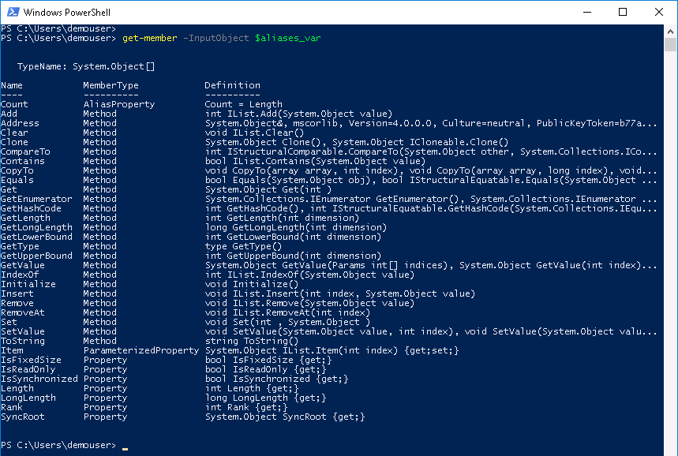
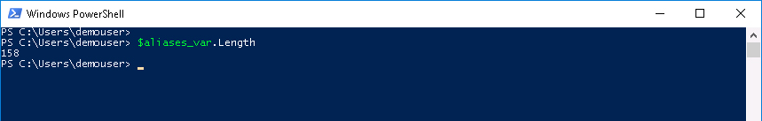
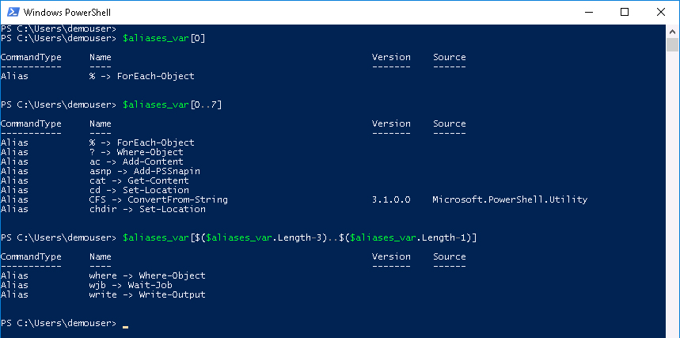
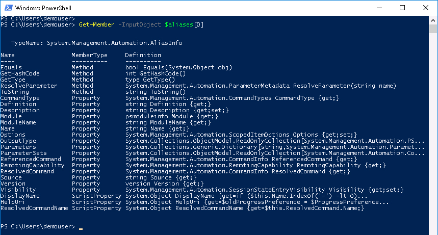
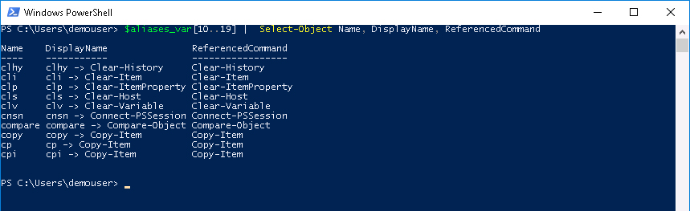

# PowerShell Cmdlets and Objects

# Step 2: Understanding PowerShell Object vs. text, plus Cmdlet naming, Aliases and Arrays

Why are objects awesome? Think about running a CLI command in a switch or in a linux shell, you get back text. Text is good and a lot has been done with text. In fact there are several linux tools for managing text, like [**sed** and **awk**](http://shop.oreilly.com/product/9781565922259.do). These tools have been around a long time and are still useful today for their pattern matching and text processing abilities.

But text is really meaningless, there is no context with text. There may be structure to the text but that structure is open to the interpretation of the developer using the text in their code to make decisions.

For example let's use the dice idea from the PowerShell Introduction lab. However, in this case the dice are not individual die objects but just a program called ***dice*** (not a real program in your environment, just an example). The ***dice*** program takes a single input to represent the number of dies to roll with the assumption of a 6 sided die. When ***dice 2*** is run this is the output:

  - "Roll Result: die 1: 4 die 2: 3"

When ***dice 5*** is run this is the output:

  - "Roll Result: die 1: 4 die 2: 3 die 3: 6 die 4: 1 die 5: 3"

Now the output needs to be parsed/tokenized, basically broken apart into individual components that can be deciphered and made sense of with respect to the number of die that were rolled and each die's result.

Can you see the difficulty of managing the output of just this simple program? Suppose a bit after ***dice*** was released the ***dice*** developer got some feedback asking to add commas in between the dies in the output, which was done and the release notes were updated. Now the output of the two previous rolls looks likes this:

  - "Roll Result: die 1: 4, die 2: 3"

  - "Roll Result: die 1: 4, die 2: 3, die 3: 6, die 4: 1, die 5: 3"

It's a subtle change and perhaps you've read the release notes. But still it requires that wherever you've used ***dice***, those scripts need to be updated to manage the addition of the new comma separator. Also think about the types of the numbers in the output above. The 1 in the string "die 1" is part of the name of the die, while 4 which is the value of the roll of "die 1" is an integer.

With a text result if you wanted to add up the result of each die, you would need to first convert that output of each die to an integer before you could add them together.

Objects include the type with each property. When accessing the property, the type is maintained. Let's explore some objects using Cmdlets for PowerShell Aliases and see if we can find some interesting stuff.

### Exercise 3

We have seen that Cmdlets have a naming convention, **Verb-Noun** or **Action-Thing**, but you know admins and scripters often get tired typing so many characters every day, so PowerShell has aliases. You can alias a Cmdlet to a string (typically shorter) of letters/numbers/symbols with `New-Alias` or `Set-Alias`.

PowerShell aliases are easy to figure out. However I'm going to recommend that you do not use them in a script that might have to be maintianed or used by someone else, except for the ones that are very well known or where the alias is so close to the Cmdlet in meaning that its function is very obvious. For example, the alias for **Sort-Object** is **sort**, contrast that with the alias for **Receive-PSSession** which is **rcsn**. Outside of a script, for your day-to-day use, use all the aliases that you want. Microsoft also has some alias [guidelines](https://msdn.microsoft.com/en-us/library/dd878329%28v=vs.85%29.aspx).

Let's look at some aliases.

  1. At the prompt type:

    ```PowerShell
    Get-Alias
    ```

    </br>Get-Alias Output:

    <br/><br/>

    <br/><br/>

  Store all the results of `Get-Alias` in a variable.<br/><br/>

  2. At the prompt type:

    ```PowerShell
    $aliases_var = Get-Alias

    $aliases_var
    ```

    </br>Get-Alias output to a variable Output:

    <br/><br/>

    <br/><br/>

  Is it all that different than before? Yeah, instead of the output just being on the screen the output is in a variable called `$aliases_var` which is actually an array. Want to know how many objects are in the array? Just access the array object's  `Length` property. There is also a `Count` property member in the array object that gives the same output as the `Length` property, because the `Count` property is an alias to the `Length` property. The `Count` property is an object member with a type of `AliasProperty`.

  Let's look at the members of the `$aliases_var` array.<br/><br/>

  3. At the prompt type:

    ```PowerShell
    Get-Member -InputObject $aliases_var
    ```

    </br>Get-Member Output:

    <br/><br/>

    <br/><br/>

  Let's find out how many *aliases* there are.<br/><br/>

  4. At the prompt type:

    ```PowerShell
    $aliases_var.Length
    ```

    </br>$aliases_var.Length Output:

    <br/><br/>

    <br/><br/>

  So there are quite a number of alias objects in the `$aliases_var` array. Let's look at the very first one and then let's look at the first 8. Then, we might as well look at the last 3.<br/><br/>

  5. At the prompt type:

    ```PowerShell
    $aliases_var[0]

    $aliases_var[0..7]

    $aliases_var[$($aliases_var.Length-3)..$($aliases_var.Length-1)]
    ```

    </br>$aliases_var Access Output:

    <br/><br/>

    <br/><br/>

  A few things to explain here

    - PowerShell array elements are accessed via the array subscript operator - also known as brackets [].
    - PowerShell arrays start at 0.
    - PowerShell has a Range Operator .. the Range Operator lets you specify a beginning and an end.
    - A range operator and variables can be used inside the array brackets. When used inside the array brackets, all the objects in that range are displayed. In other words the range operator is inclusive of it's endpoints.
    - Wrapping `$array_variable.Length-1` inside `$()` tells PowerShell to evaluate what is in `$()` first.

  </br>The last command could also have been issued as `$aliases_var[$($aliases_var.Length-3)..$aliases_var.Length]` and the output would have been the same. Why? Because PowerShell doesn't give an error on an array element that doesn't exist. Remember arrays in PowerShell start at 0 (zero), so they must end at `$array_variable.Length-1`, so `$array_variable.Length` would actually access an array element that did not exist. PowerShell just returns nothing.

### Exercise 4

We have an array of PowerShell alias objects that was populated by executing `Get-Alias` and setting the output to a variable called `$aliases_var`. The array `$aliases_var` is an array object that has its own member properties and methods and the objects that are contained in the array have their own member properties and methods.

Anytime you issue a PowerShell Cmdlet that returns **more than one** object and you are saving those objects to a variable, the variable type will be an array. **IF** the PowerShell Cmdlet only returns a single object the resulting variable **WILL NOT** be an array. However, you can **force** a single object array to be created by wrapping the Cmdlet in **@()**.

For example, `Get-Date` returns a single object. When the result of `Get-Date` is set to a variable, the variable will contain a single object, like `$his_birthday`.

If you had issued the `Get-Date` command for `$his_birthday` like this:

  ```PowerShell
  $his_birthday = @(Get-date -Month 8 -Day 5 -Year 1966 -Hour 0 -Minute 1 -Second 00)
  ```

`$his_birthday` would be an array with one date object at element 0.

Why force an array? Mostly to ensure that whether the Cmdlet returns one object or multiple objects, the returned object(s) variable will **always be an array** type.

Let's access all the `$aliases_var` array elements and print out the name and Cmdlet they are aliasing. First find out the object's members.

  1. At the prompt type:

    ```PowerShell
    Get-Member -InputObject $aliases_var[0]
    ```

    </br>Get-Member for $aliases_var[0] Output:

    <br/><br/>

    <br/><br/>

    You ran the `Get-Member` command earlier on this page for the `$aliases_var` array, now you are running it for an element in the array.

    An array can contain elements that have different object types. In this case all the objects in the `$aliases_var` array are `Get-Alias` objects, but there is nothing stopping you from adding to this array `Get-Date` objects or anything else.

    Suppose we are interested in three properties from `Get-Alias` the **Name**, **DisplayName**, and **ReferencedCommand**, and we want to see what is in `$aliases_var` array elements 10 through 19.

  2. At the prompt type:

      ```PowerShell
      $aliases_var[10..19] | Select-Object Name, DisplayName, ReferencedCommand
      ```

    </br>$aliases_var Range with Select-Object Output:

    <br/><br/>

    <br/><br/>

    The command accessed `$aliases_var` array elements 10 though 19 and piped the accessed alias objects to the `Select-Object` Cmdlet. The `Select-Object` Cmdlet was instructed to output the three properties **Name**, **DisplayName**, and **ReferencedCommand**.

    How did `Select-Object` know what to do? What is the Object Pipeline? These questions and more are answered in the Lab **PowerShell - Pipelining and Output**, be sure to check it out!

Congratulations! You've Completed Lab - PowerShell Cmdlets and Objects
