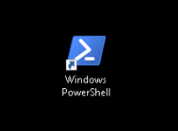
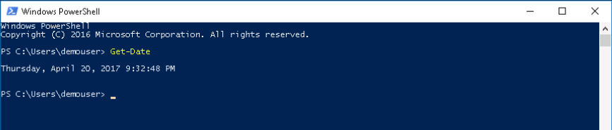
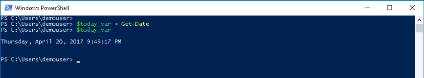
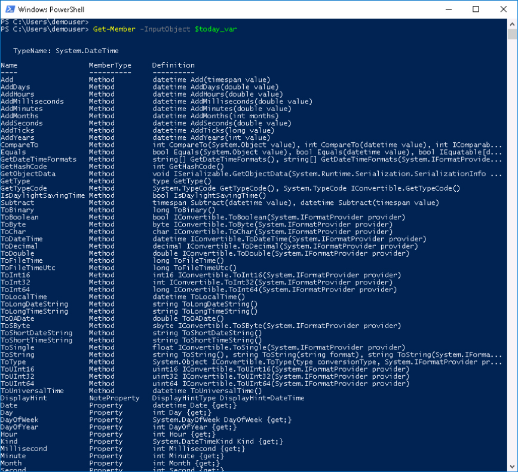

# PowerShell Introduction

This lab is a brief introduction to Microsoft PowerShell.

# Objectives

After completing this lab you will:

  - Know how PowerShell is different from a typical CLI or shell script
  - Know how to examine PowerShell Variables and Objects
  - Understand PowerShell Verb-Noun naming style

# Prerequisites

Showing up is the biggest prerequisite and also running Windows. Actually, that isn't true anymore, [PowerShell Core](https://github.com/powershell/powershell) runs on Linux and macOS. However, for this lab we'll use Windows.

## Product

PowerShell is made by Microsoft.

The items covered in this lab and other PowerShell focused labs are greatly influenced by this [PowerShell Scripting](https://msdn.microsoft.com/en-us/powershell/scripting/powershell-scripting) content on the [Microsoft Developer Network](https://msdn.microsoft.com/en-us/default.aspx).

### DevNet Sandbox Utilization

All this lab requires is a Windows Desktop that has PowerShell, if you don't happen to have a Windows Desktop available that's OK. You can complete this lab using the DevNet UCS Management Sandbox, there is a Windows 2012 VM as part of the sandbox. Reserve your environment [here](https://devnetsandbox.cisco.com/RM/Diagram/Index/3323b7b0-b70b-4b1e-a929-6bdbff3aac8a?diagramType=Topology).

# Step 1: Understanding how PowerShell different from a typical CLI or shell script

The MSDN Site explains it this way:

  - Unlike most shells, which **accept and return text**, Windows PowerShell is built on top of the .NET Framework common language runtime (CLR) and the .NET Framework, and **accepts and returns .NET Framework objects**. This fundamental change in the environment brings entirely new tools and methods to the management and configuration of Windows.

Whoa that's a big deal, do you have to know what the **.NET CLR** is or what the **.NET Framework** is to use PowerShell? **No**. Just remember that PowerShell returns objects.

What's an Object, you ask. Think about a pair of programmable six-sided dice, each die is an object and those die have properties and methods.

**Dice Objects**:


- **Die properties**
  - Number of sides
  - Number of dots per side
  - Color

- **Die methods**
  - do-roll()
  - get-side-up()
  - get-dots()
  - get-stats()

In PowerShell terminology the **Object Properties** and **Object Methods** together are known as **Object Members**.

Let's take a look at an object and its members, through some exercises.

### Exercise 1

Retrieve a PowerShell object, inspect its Properties and Methods.

Microsoft provides two interfaces for PowerShell, the PowerShell Console and the PowerShell Integrated Scripting Environment (ISE). We'll use the PowerShell Console.

  1. Open the PowerShell Console, by ***double-clicking*** the desktop shortcut.

  PowerShell Desktop Shortcut:

  

  If there is no desktop shortcut you can typically find PowerShell under the **Windows PowerShell** menu or by typing *cmd-s* to bring up search and then search for **PowerShell**.  

  2. When PowerShell is running At the prompt type:

    ```PowerShell
    Get-Date
    ```

  </br>A date is returned in a default format.

  Get-Date Output:

  

  PowerShell is case **in-sensitive** so a variation like `get-date` would have worked as well.

  The `Get-Date` output looks like a date, but there really is a object there. Let's try again but this time save the object returned by **Get-Date** into a PowerShell variable.<br/><br/>

  3. At the prompt type:

    ```PowerShell
    $today_var = Get-Date
    ```

  </br>If all went well... **nothing** happened... or did something happen? Yes something happened, the `Get-Date` object is now stored in the `$today_var` variable.<br/><br/>

  4. At the prompt type:

    ```PowerShell
    $today_var
    ```

  <br>Get-Date and $today_var Output:

  

  The date printed out just like before.

  If you are at all familiar with scripting or programming you might be thinking that a character string that looks like the output is what is in the variable `$today_var`, that wouldn't be an unrealistic thought. However that is not the case, let's inspect the data **object** stored in `$today_var`.<br/><br/>

  5. At the prompt type:

    ```PowerShell
    Get-Member -InputObject $today_var
    ```

  </br>Get-Member Output:

  

  Turns out the `$today_var` date object has a lot of properties and methods.

  If the value retuned from `Get-Date` was just a string, we would have to send it to some other script or program to convert it to something else. But because it is an object with many methods and properties, we can take the `$today_var` date object and use it in different ways.

  **Everything in PowerShell is an object**. Even if it is just a string that **your** script outputs, it is a **string object**.

  We'll access different properties and methods of the `Get-Date` object in the next step.

## Next Step: PowerShell Object Member Access
