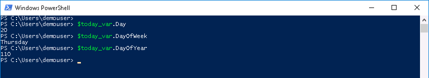
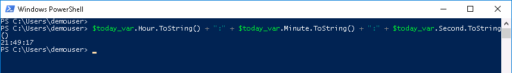
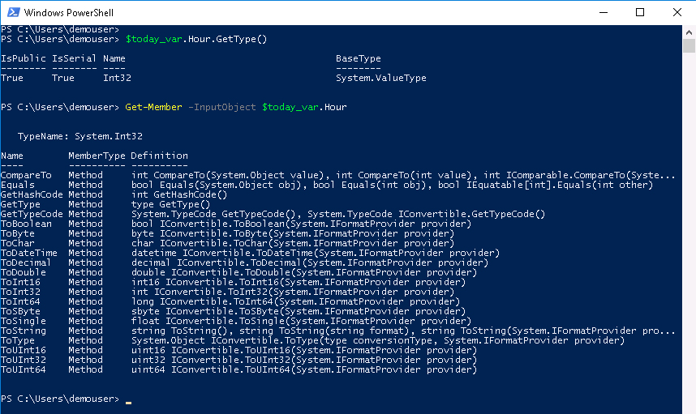
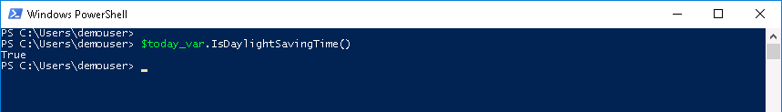
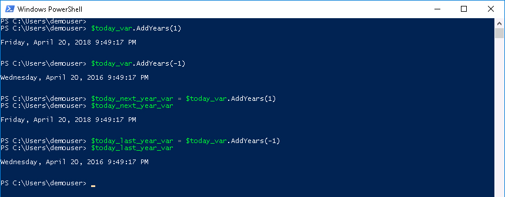

# Step 2: Accessing PowerShell Object Members

How a PowerShell object member is accessed is determined by the type of member it is.  If the object member is a property, then you access it this way:

  `$variable_name.property`

If the object member is a method, then you access it this way:

  `$variable_name.method()`

  Sometimes one or more values are required inside the method parenthesis, it all depends upon the method and what is being done.  We will try a method without a value and one with a value.

### Exercise 2

View the day of the **month**, the day of the **week**, and the day of the **year** that the date object represents.

  1. At the prompt type:

    ```PowerShell
    $today_var.Day
    $today_var.DayOfWeek
    $today_var.DayOfYear
    ```

  </br>Date Object - Day, DayOfWeek, and DayOfYear Output

  

  Try some other properties.<br/><br/>

  2. At the prompt type:

    ```PowerShell
    $today_var.Date
    $today_var.Hour
    $today_var.Minute
    $today_var.Second
    $today_var.Year
    ```

  </br>Suppose you wanted to build a string that was the current time in the format `Hours:Minutes:Seconds`, maybe to use as part of a log file name or to insert the time into a file or just to display it.

  You would need to get those three properties and ***concatenate*** them with colons (:) as the separator.<br/><br/>

  3. At the prompt type:

    ```PowerShell
    $today_var.Hour.ToString() + ":" + $today_var.Minute.ToString() + ":" + $today_var.Second.ToString()
    ```

  </br>Date Object Properties Concatenated:

  

  It looks like when the `$today_var` properties were accessed we then needed to access a method of the property. Whoa again, does that mean that the property of an object can be another object and have its own object members? Yes it does!

  The reason we needed to use the `.ToString()` method with the Hour, Minute, and Second properties is because they are actually integers and you cannot concatenate (the "+" operator) an integer with a string (the colon ":").

  How can you find out a properties' type? With the `.GetType()` method. How can you find out all the members of the properties' type? With `Get-Member`<br/><br/>

  4. At the prompt type:

    ```PowerShell
    $today_var.Hour.GetType()
    Get-Member -InputObject $today_var.Hour
    ```

  </br>GetType() and Get-Member of the Type Output:

  

  We're getting a little too deep into the object, let's back out a bit look at some methods of the `Get-Date` object.

  We have already seen `.GetType()`, it is a method that does not require any input. Let's look at a date object method that does not require input and one that does.

### Exercise 3

The globe is split into multiple time zones, some time zones adhere to Daylight Saving Time and some do not. Time itself is only relative to where we are and to the season we are in. If you are interested in Time and how the Earth's movement affects Time, take a look a [this](https://www.youtube.com/watch?v=IJhgZBn-LHg), when you have some free **Time**, for now back to PowerShell...

If you are wondering, in your time zone, if it is Daylight Saving Time. You're in luck because you can get that answer from the date object.

  1. At the prompt type:

    ```PowerShell
    $today_var.IsDaylightSavingTime()
    ```

  </br>IsDaylightSavingTime() Output:

  

  That's an interesting method and like `.GetType()` no input is required.

  Remember the property `.DayOfWeek`? It showed the current day of the week. Suppose you wanted to know what day of the week your date object would be a year from now. Well there is a method to add years to a date object and if we do that we can see what the day of the week will be next year or the year after that and so on and so on.

  Something to remember is that the date object stored in the `$today_var` variable is an instance of a date type that was instantiated (created) when we ran `Get-Date`. It **has not** been incrementing time, the date object is frozen in `$today_var`. The method `.AddYears()` will add the specified positive or negative years and display the date those number of years, before or after the date object's. This method does not change the original object. The result of adding years to the original date object can be saved to another date object. Let's check it out.<br/><br/>

  2. At the prompt type:

    ```PowerShell
    $today_var.AddYears(1)
    $today_var.AddYears(-1)
    $today_next_year_var = $today_var.AddYears(1)
    $today_next_year_var
    $today_last_year_var = $today_var.AddYears(-1)
    $today_last_year_var
    ```

  </br>Date Arithmetic:

  

We have been running a few different commands:
  - To get objects
  - To look at what's in an object
  - To create a new object from an existing one but with different property values

Just what commands are available in PowerShell and how do you know what they do? We'll cover that in the next step.

## Next Step: What and How Many PowerShell Commands are there?
