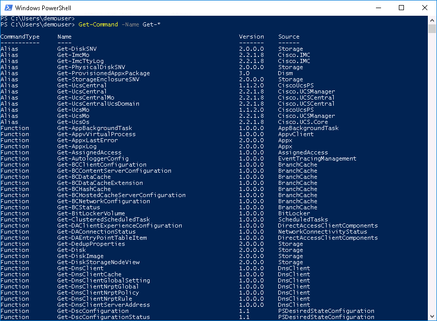
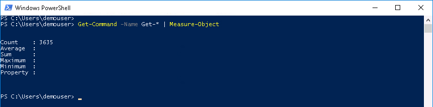

# Step 3: Exploring available PowerShell Cmdlets

What are these commands we've been running and how do we know what commands are available?

Let's start with what PowerShell Commands are called

  - PowerShell commands are called Cmdlets - pronounced "command-lets"

  Sort-of like a little command, but don't let the name fool you, full-blown mega-huge massively-large colossal-gigantic systems are built in PowerShell.

How many Cmdlets are there? There are literally thousands and thousands of PowerShell Cmdlets. Maybe more than that as vendors add their own PowerShell modules and Microsoft continues to add to PowerShell.

### Exercise 4

How can you find out what Cmdlets are available?

  1. At the prompt type:

    ```PowerShell
    Get-Command -Name Get-*
    ```

    </br>Get-Command Output:

    <br/><br/>

    <br/><br/>

  There's a lot of output here in fact maybe so much that you can't even scroll back to the top of the list.

  Let's find some other commands.<br/><br/>

  2. At the prompt type

    ```PowerShell
    Get-Command -Name Set-*
    Get-Command -Name New-*
    Get-Command -Name Remove-*
    Get-Command
    ```

  See them all?

  Cmdlets follow a naming scheme **Verb-Noun** or **Action-Thing**

  Here's more information about [Microsoft PowerShell Verbs.](https://msdn.microsoft.com/en-us/library/ms714428%28v=vs.85%29.aspx)

  Most vendors adhere to this convention fairly well.

  Just how many **Get** Cmdlets are on your system?<br/><br/>

  3. At the prompt type

    ```PowerShell
    Get-Command -Name Get-* | Measure-Object
    ```

    </br>Get-Command and Measure-Object Output:

    <br/><br/>

    <br/><br/>

  You just ran your first PowerShell pipeline... in this lab at least.

There is much to learn in PowerShell. Here are some references to other topics to help you on your way to more PowerShell greatness.  

  - [PowerShell Best Practices](https://blogs.technet.microsoft.com/pstips/2014/06/17/powershell-scripting-best-practices/)

  - [PowerShell Tips and Tricks](https://powershell.org/category/tips-tricks/)

  - [Hey, Scripting Guy Blog](https://blogs.technet.microsoft.com/heyscriptingguy/)

We've started the discussion of PowerShell by introducing some basic examples and a few PowerShell terms. If you're ready to go deeper into Cmdlets and Objects, be sure to try the lab **PowerShell - Cmdlets and Objects**!

Congratulations! You've Completed the Lab - ***PowerShell Introduction***
