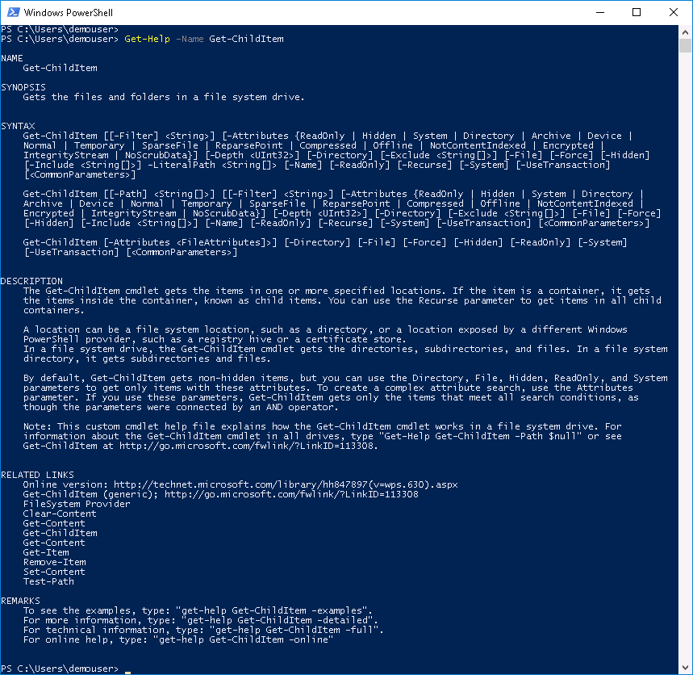
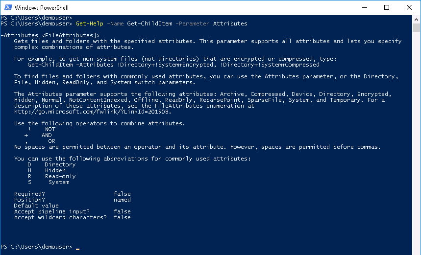

# Mission: Introduction to PowerShell - Basic Mission

### Exercise 1 - Solution

  1. At the prompt type:

    ```PowerShell
    Get-Help -Name Get-ChildItem
    ```

    Get-Help Get-ChildItem Output:

    <!--<br/><br/>-->

    <br/><br/>

  You should see in the output that the valid values for the `-Attributes` parameter are:

    - ReadOnly
    - Hidden
    - System
    - Directory
    - Archive
    - Device
    - Normal
    - Temporary
    - SparseFile
    - ReparsePoint
    - Compressed
    - Offline
    - NotContentIndexed
    - Encrypted
    - IntegrityStream
    - NoScrubData

  2. At the prompt type:

    ```PowerShell
    Get-Help -Name Get-ChildItem -Parameter Attributes
    ```

  Get-Help Get-ChildItem Attributes Parameter:

  <!--<br/><br/>-->

  <br/><br/>

  You should see in the output that indeed the string `!Directory+!System+Encrypted, !Directory+!System+Compressed` is valid.

### Exercise 2

  1. Use `Get-Command` to find out how many Cmdlets  contain the string **Event**

    - To Complete this exercise task you'll need to use the `Get-Command` Cmdlet and the `Measure-Object` Cmdlet

  2. Could task one be done more than one way?

Go to the next page for the solution...
