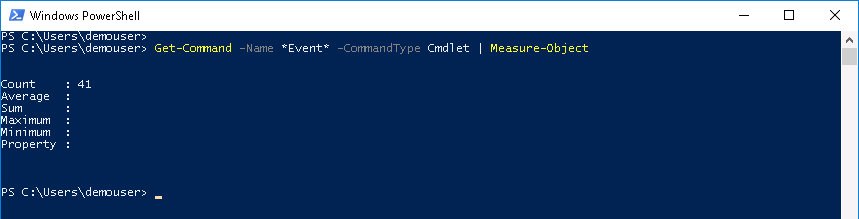

# Mission: Introduction to PowerShell - Basic Mission

### Exercise 2 - Solutions

  1. At the prompt type:

    ```PowerShell
    Get-Command -Name *Event* -CommandType Cmdlet | Measure-Object
    ```

  Get-Command for Cmdlets Containing Event Output:

  <!--<br/><br/>-->

  <br/><br/>

  There are other ways to do this.</br></br>

  2. At the prompt type:

    ```PowerShell
    Get-Command -CommandType Cmdlet | ?{$_.Name -like "*Event*"} | Measure-Object
    ```

    or

    ```PowerShell
    Get-Command -CommandType Cmdlet | Select-String Event | Measure-Object
    ```

  These are not the only solutions, why would you use one over the other depends upon what you are looking to achieve.

### Exercise 3

  1. Use `Get-Process` and `Tee-Object` Cmdlets to write to the console and to a file at the same time. Only show processes with the `ProcessName` of **svchost**. Name the file `get-process.txt` and write it in the current directory.

    - To complete this exercise task you'll need to use the `Get-Process` Cmdlet with the `-ProcessName` parameter and the `Tee-Object` Cmdlet with the `-FilePath` parameter.

  2. View the file with the `Get-Content` Cmdlet

Go to the next page for the solution...
