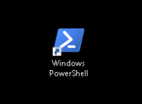

# Mission: Introduction to PowerShell - Advanced

Take what you've learned about PowerShell from the Introduction to PowerShell Learning Labs and put that knowledge to use with some trickier tasks.

## Objectives

Completion time: 10 minutes

  - Create an Array Object with the Range operator **..** and `ForEach-Object` Cmdlet
  - Create another Array Object, this time with Type Casting and some other cool stuff

## Prerequisites

Knowing a bit about PowerShell helps and since you've most likely completed the Introduction to PowerShell Learning Labs, you are all set and ready to go.

### Exercise 1

Open the PowerShell Console by ***double-clicking*** the desktop shortcut.

PowerShell Desktop Shortcut:

<!--  -->

  

  1. Use the Range Operator **..** and the `ForEach-Object` Cmdlet *(if you need to)* to create an array containing 100-110, and name the array `$my_array`.

  2. Display `$my_array`.

  3. Count the objects in `$my_array`.

Are there any other ways to make `$my_array`?

Go to the next page for the solution...
