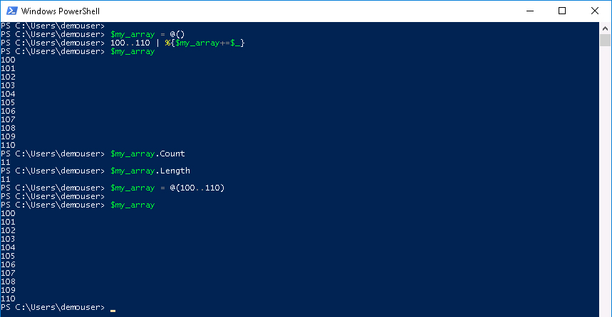

# Mission: Introduction to PowerShell - Advanced Mission

### Exercise 1 - Solutions

  1. At the prompt type:

    ```PowerShell
    $my_array = @()
    100..110 | %{$my_array+=$_}
    $my_array
    $my_array.Count
    $my_array.Length
    ```

  Another way to create the array

    ```PowerShell
    $my_array = @(100..110)
    ```

  PowerShell Array Creation:

  <!--<br/><br/>-->

  <br/><br/>

### Exercise 2

  1. Use the Range Operator **..** to create an array containing A-Z and a-z, and name the array `$my_array`.

    - To complete this exercise task you'll need to **cast** the Integer type to a **[char]**; the ASCII integers for A-Z are 65-90, and the integers for a-z are 97-122.

  2. Write `$my_array` to the console, separating each letter with a comma. Precede the array display with a blank line and follow it with a blank line.

    - To complete this task you'll need to use the `Write-Host` Cmdlet with the `-Separator` parameter.

Could task one be done more than one way?

Go to the next page for the solution...
