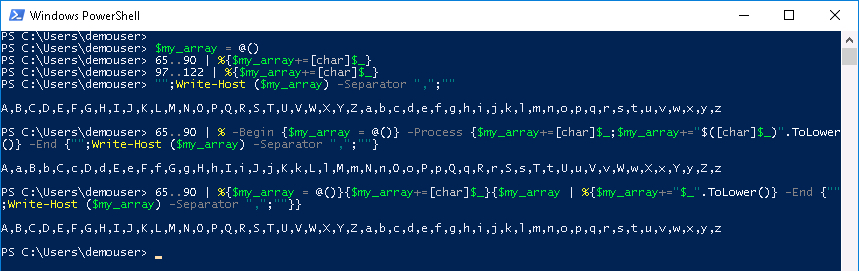
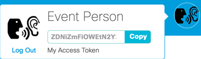
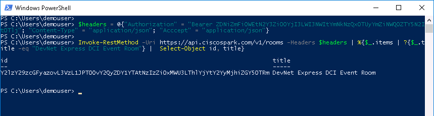
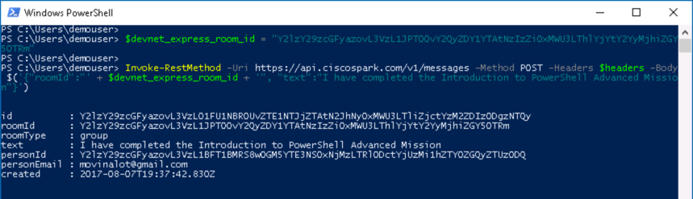
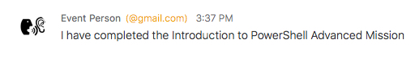
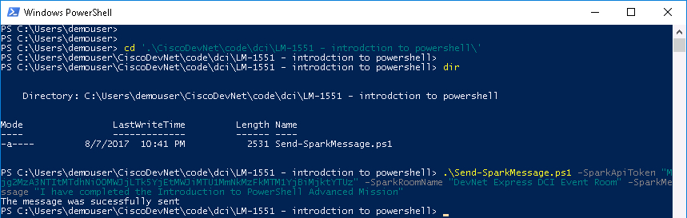

# Mission: Introduction to PowerShell - Advanced Mission

### Exercise 2 - Solutions

  1. At the prompt type:

    ```PowerShell
    $my_array = @()
    65..90 | %{$my_array+=[char]$_}
    97..122 | %{$my_array+=[char]$_}
    "";Write-Host ($my_array) -Separator ",";""
    ```

  Another way to create the array in a single line, using only the ASCII integers for A-Z is

    ```PowerShell
    65..90 | % -Begin {$my_array = @()} -Process {$my_array+=[char]$_;$my_array+="$([char]$_)".ToLower()} -End {"";Write-Host ($my_array) -Separator ",";""}
    ```

  PowerShell Array Creation Advanced:

  <!--<br/><br/>-->

  <br/><br/>

  An explanation is in order for the second solution.

    - The ASCII character codes for A-Z are 65-90. Using the range operator, each integer object is sent down the pipeline.

    - The `ForEach-Object` Cmdlet, aliased as **%**, has the ability to process **Begin**, **Process**, and **End** blocks.

      - **Begin** block code is run once ***before*** the first object is processed.

      - **Process** block code is run for ***every*** object.

      - **End** block code is run once ***after*** all the objects have been processed.

      - The `-Begin`, `-Process`, and `-End` are not required, if omitted **Code Block Precedence** is:

        - One block is a Process block.
        - Two blocks are Begin and Process blocks, in that order.
        - Three Blocks are Begin, Process, and End blocks, in that order.

    - The **Begin** block initialized `$my_array` to an empty array.

    - The **Process** block:
      - Added the [char] representation of the Integer to the array.
      - Added the lowercase [char] representation of the Integer to the array. However, the **$()** construct inside double quotes **"** was used to first cast the Integer to a character. Then the `.ToLower()` member method of the String object was used to lowercase the letter.

    - The **End** block displays `$my_array` with a blank line before and after.

  There is a slight difference in the arrays created by the two methods. Both contain all the letters A-Z and a-z. However, in the first array A-Z is followed by a-z; in the second array the pattern is A,a,B,b,C,c and so on to Z,z.

  Is there a single line method to achieve the same array as the first method? No need to figure it out, I've shown it below.

    ```PowerShell
    65..90 | %{$my_array = @()}{$my_array+=[char]$_}{$my_array | %{$my_array+="$_".Tolower()} -End {"";Write-Host ($my_array) -Separator ",";""}}
    ```

  In this last example the **End** block was specified because only two blocks were specified and the default is to process the blocks as **Begin** and **Process** blocks.

### Mission Completion

Update the **Event Spark Room** with a ***Completion Message***

  1. Retrieve your Spark API Access Token. This token is your permanent developer token and is used to access Spark APIs.

    - Login to [Spark Developer Website](https://developer.ciscospark.com/)
    - ***Click*** on your profile image
    - ***Click*** **Copy** to copy your access token to the clipboard<br/><br/>

    <!--<br/><br/>-->

    <br/><br/>

  2. Use the PowerShell `Invoke-RestMethod` Cmdlet to Retrieve the DevNet Express Event Room Id

    - Cisco Spark has a REST API to retrieve all the Rooms that you are subscribed to. To execute the API through the PowerShell `Invoke-RestMethod` Cmdlet you will need to send your Access Token in the header of the request using a [PowerShell hash table construct](https://docs.microsoft.com/en-us/powershell/module/Microsoft.PowerShell.Core/about_Hash_Tables?view=powershell-5.1). A PowerShell hash table is a common programming construct know as an [*Associative Array*](https://en.wikipedia.org/wiki/Comparison_of_programming_languages_&#40;associative_array&#41;) and is similar to a Python Dictionary (dict). The elements of a hash table are ***Key/Value*** pairs. Set these values in the hash table `$headers` (this is an arbitrary variable name, you could have used any name).

      - **Authorization** - The value is ***your*** API Token, prefixed by the string "**Bearer** "
      - **Content-Type** - The value is **application/json** - This indicates the format of request data (if any).
      - **Accept** - The value is **application/json** - This indicates the **requested** format of response data (if any).

    ```PowerShell
    $headers = @{"Authorization" = "Bearer ***your*** API Token"; "Content-Type" = "application/json"; "Acccept" = "application/json"}
    ```

    - Use the Cisco Spark Rooms API and find the DevNet Express Event Room. In this example the room name is **"DevNet Express DCI Event Room"**. The Cisco Spark Rooms API will return a JSON construct that PowerShell will put into an array of hash tables, one hash table for each room. The array is called **items**

      - The Cisco Spark Rooms API Uri is https://api.ciscospark.com/v1/rooms

    ```PowerShell
    Invoke-RestMethod -Uri https://api.ciscospark.com/v1/rooms -Headers $headers | %{$_.items | ?{$_.title -eq "DevNet Express DCI Event Room"} |  Select-Object id, title}
    ```

      - The default *method* for `Invoke-RestMethod` is **GET** and does not need to be specified.
      - The results of the `Invoke-RestMethod` Cmdlet are pipelined to a `ForEach-Object` Cmdlet
      - Each Object is pipelined to a `Where-Object` Cmdlet
      - When the hash table with a `title` key that has a `value` that matches the Room name, the `title` and `id` values from the hash table are displayed.<br/><br/>

    <!--<br/><br/>-->

    <br/><br/>

  3. Post the message "I have completed the Introduction to PowerShell Advanced Mission" to the DevNet Express Event Room

    - Cisco Spark has a REST API to send Messages. To execute the API through the PowerShell `Invoke-RestMethod` Cmdlet you will need to send your Access Token in the header of the request, as well the Messages API requires the message and the destination Room Id in JSON format.
    - The Cisco Spark Messages API Uri is https://api.ciscospark.com/v1/

    ```PowerShell
    $devnet_express_room_id = "Y2lzY29zcGFyazovL3VzL1JPT00vY2QyZDY1YTAtNzIzZi0xMWU3LThlYjYtY2YyMjhiZGY5OTRm"

    Invoke-RestMethod -Uri https://api.ciscospark.com/v1/messages -Method POST -Headers $headers -Body $('{"roomId":"' + $devnet_express_room_id + '", "text":"I have completed the Introduction to PowerShell Advanced Mission"}')
    ```

      - The **POST** method was specified for `Invoke-RestMethod`
      - The **Body** JSON was specified
      - The **Body** JSON is evaluated first by utilizing the `$()` construct in PowerShell<br/><br/>

    <!--<br/><br/>-->

    <br/><br/>

  4. View your message in the DevNet Express Event Room.

    <!--<br/><br/>-->

    <br/><br/>

### Mission Completion - Quick Mode

  Run the PowerShell Script `Send-SparkMessage.ps1`

  1. Change to the directory "C:\Users\demouser\CiscoDevNet\code\dci\LM-1551 - introduction to powershell"

  2. Run the `Send-SparkMessage.ps1` Cmdlet, specify the following parameters:

    - -SparkApiToken - The value is your API Token in double quotes
    - -SparkRoomName - The value is the name of the Spark Room to send the message to in double quotes
    - -SparkMessage - The value is the message in double quotes

    ```PowerShell
    .\Send-SparkMessage.ps1 -SparkApiToken "ZDNiZmFiOWEtN2Y3Zi00YjI3LWI3NWItYmNkNzQxOTUyYmZiNWQ0ZTY5N2ItOT" -SparkRoomName "DevNet Express DCI Event Room" -SparkMessage "I have completed the Introduction to PowerShell Advanced Mission"
    ```

    <!--<br/><br/>-->

    <br/><br/>

Congratulations you have completed the Advanced Mission for Introduction to PowerShell.
